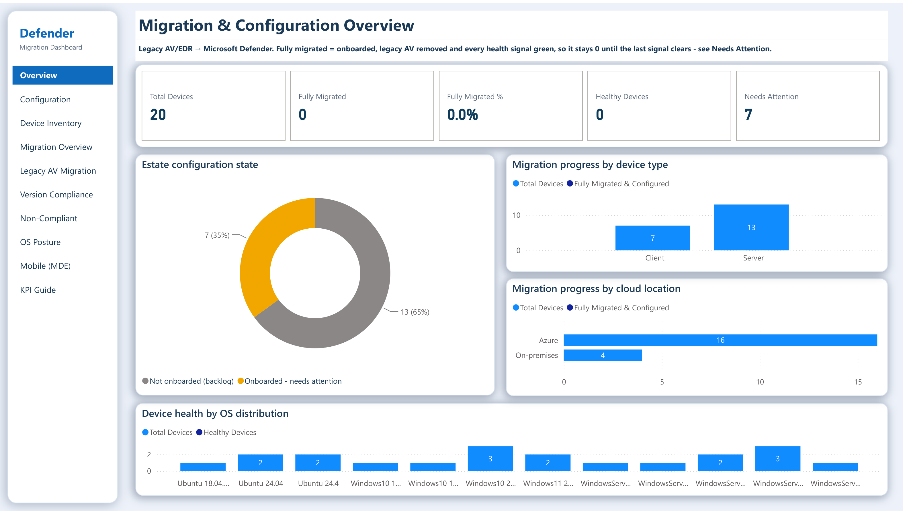
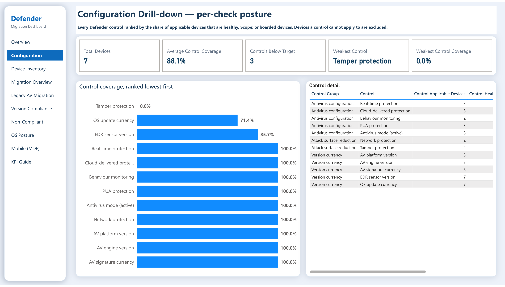
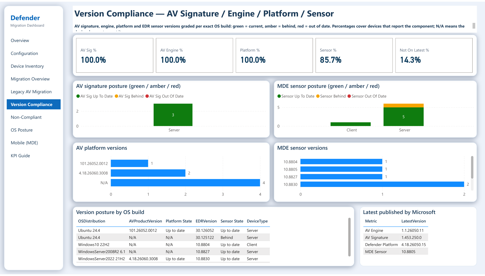
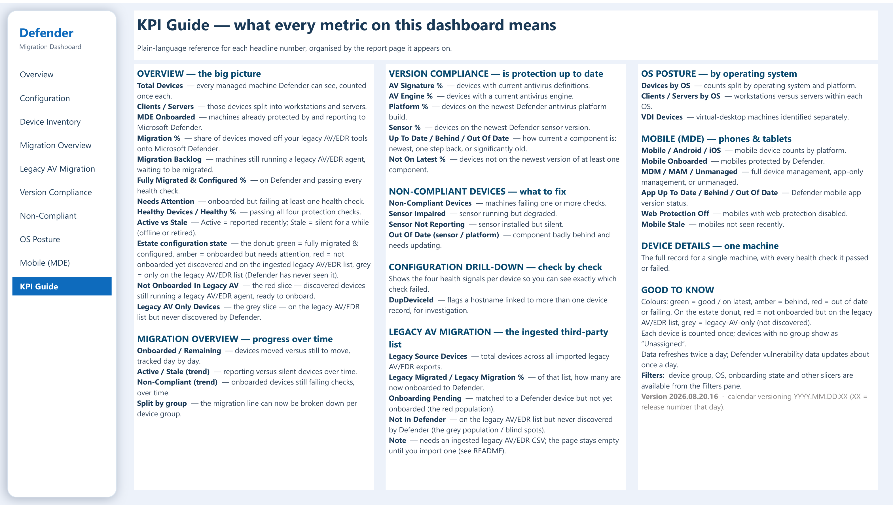

# Defender Migration Dashboard

A self-contained Power BI dashboard for running and reporting on a **Microsoft Defender for Endpoint
(MDE) + Defender Antivirus (MDAV) migration** — off **any** third-party AV/EDR: Trend Micro,
Symantec, McAfee/Trellix, Sophos, CrowdStrike, SentinelOne, Kaspersky, ESET, Bitdefender, Carbon
Black, Cortex XDR and more. Several products can be tracked **side by side**, because every ingested
device row keeps its own legacy product and vendor label.

It reads **live from your own Defender tenant** through the export-assessment REST APIs
(`api.securitycenter.microsoft.com`) — no data lake, no Sentinel, no Log Analytics, and no
10,000-row hunting cap, so it scales to 100k+ device estates. One command publishes the semantic
model and report to a Power BI / Microsoft Fabric workspace, binds the data source to your Entra app
as a Service Principal, seeds the 30-day trend history, and enables scheduled refresh.

---

## Screenshots

| Overview | Configuration drill-down |
|---|---|
|  |  |

| Version compliance | KPI guide |
|---|---|
|  |  |

> Captured from a demo tenant. Only aggregate pages are shipped — the pages that list individual
> machines are omitted so no device name ever reaches the repository.
> See [docs/images/README.md](docs/images/README.md) to capture your own.

---

## Quick start

```powershell
# 1. Create/reuse the Entra app and grant the WindowsDefenderATP permissions (writes deploy/config.json)
pwsh ./deploy/Bootstrap-Deployment.ps1

# 2. Sign in and deploy (credentials come from config.json)
pwsh ./deploy/Deploy-Dashboard.ps1 -ConfigPath ./deploy/config.json -Wait

# 3. Open the report at the URL the script prints when it finishes
```

Add your legacy AV/EDR estate at any time:

```powershell
pwsh ./deploy/Import-LegacyAvInventory.ps1 -LegacyCsv .\apex-one.csv      -LegacyMode Append -ConfigPath ./deploy/config.json
pwsh ./deploy/Import-LegacyAvInventory.ps1 -LegacyCsv .\falcon-hosts.csv  -LegacyMode Append -ConfigPath ./deploy/config.json -Materialize
```

Running `Deploy-Dashboard.ps1` with **no parameters** starts a guided wizard.

---

## Prerequisites

- **Windows PowerShell 5.1** or **PowerShell 7.x** — no third-party modules. All scripts are 5.1-compatible.
- **Azure CLI** (`az`) for interactive sign-in, or an Entra app registration for service-principal deployment.
- An **Entra app registration** with four admin-consented **WindowsDefenderATP** application permissions:
  `Machine.Read.All`, `Software.Read.All`, `Vulnerability.Read.All`, `AdvancedQuery.Read.All`.
  `Bootstrap-Deployment.ps1` can create or reuse one.
- A **Power BI / Fabric workspace** on a capacity that supports semantic models (Fabric, Premium, or PPU),
  and rights to publish to it (Admin or Member).

---

## What it tracks

- **Migration maturity** — active vs stale/removed devices over time, not a point-in-time snapshot.
- **Legacy AV/EDR migration** — every device from your old console(s) mapped to the Defender
  inventory, with per-product progress so you can see which console is lagging.
- **Version compliance** — AV signature, AV engine, Defender platform and MDE sensor.
- **Third-party footprint** — which legacy agents are *still installed*, detected on-box independently
  of any CSV.
- **Operational triage** — a device-level table of non-compliant machines.
- **OS posture** and a first-class **client vs server** split.

---

## Documentation

| Doc | What's in it |
|-----|--------------|
| [Quick start](QUICKSTART.md) | The fastest path from zero to a published report |
| [Install guide](INSTALL.md) | Step-by-step installation and first deployment |
| [Legacy AV/EDR migration](docs/multi-vendor-ingest.md) | **Multi-vendor ingest**, CSV format, supported products, matching algorithm, Replace vs Append |
| [Deployment & parameters](docs/deployment.md) | Full `Deploy-Dashboard.ps1` reference, versioning, in-place updates |
| [Architecture & data model](docs/architecture.md) | How the live data path works, page-by-page breakdown, KPI design rules |
| [Security & secrets](docs/security.md) | Where credentials live, what is and isn't readable |
| [Permissions](PERMISSIONS.md) | The exact permission set and why each one is needed |
| [Troubleshooting](docs/troubleshooting.md) | Common failures, plus the repository file layout |
| [Failure codes](FAILURE-CODES.md) | Deploy-script exit codes |
| [Changelog](CHANGELOG.md) | Release history |
| [Screenshots](docs/images/README.md) | How to capture the dashboard images safely |

---

## License

MIT — see [LICENSE](../LICENSE).

## Author

Cristiano De Angelis — Microsoft Security CxD.
